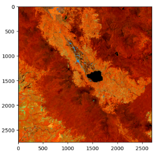
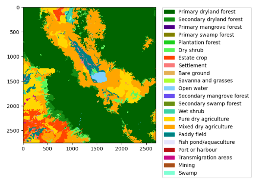

# Land-Cover-Classification using a Foundation Model (DOFA)
This repo is about using DL-based models to predict the class of each pixel from multispectral satellite images. 

### 🌍 Study Area

The data used in this project focuses on **Kerinci Regency**, located in **Jambi Province, Sumatra, Indonesia**. The region includes ecologically significant areas such as:

- Tropical forests
- Agricultural lands
- Urban expansion zones

Satellite data were clipped to a region of interest (ROI) that covers parts of the **Kerinci Seblat National Park** and surrounding areas, known for its rich biodiversity and dynamic land-cover changes. The images were exported from a Google Earth Engine (GEE).


## 📂 Data Sources

This project uses satellite imagery and labeled land cover data to train a U-Net model for pixel-wise classification. The data is composed of:

- **Land Cover Labels (Ground Truth)**  
  - File: `LC_Image_v1.tif`  
  - Description: A raster image in which each pixel value represents a specific land cover class (e.g., forest, urban, water).  
  - The ground truth labels are displayed in the figure below.
  

- **Land Cover Metadata**  
  - File: `lc.json`  
  - Description: A JSON file defining land cover class IDs, names, and color palettes.  
  - Purpose: Used to normalize and visualize land cover classes.

- **Landsat Satellite Imagery**  
  - File: `Landsat_Kerinci_2023_v1.tif`  
  - Description: Multi-band Landsat imagery (e.g., bands 4–7) used as input features for classification.  
  - Preprocessing: Pixel values are scaled to surface reflectance.

- **(Optional) ALOS PALSAR Radar Imagery**  
  - File: `Palsar_Kerinci_2023_v1.tif`  
  - Description: Radar backscatter data that can be integrated with optical imagery to enhance classification performance (not yet fully integrated in the current pipeline).

---

## 🧪 Preprocessing Pipeline

This section describes the preprocessing steps used to prepare satellite imagery and land cover data for training a U-Net model for pixel-wise land cover classification.

### 1. 🔹 Load and Normalize Land Cover Classes
- Land cover metadata is read from `lc.json`, containing:
  - Class IDs (`values`)
  - Class names (`label`)
  - Hex color codes (`palette`)
- Each land cover class is assigned a **normalized integer value** starting from 1 to ensure compatibility with deep learning models.
- Color palettes and labels are mapped for later use in visualization and interpretation.

### 2. 🗺️ Load and Remap Ground Truth Label Image
- The land cover (label) image is loaded from a `.tif` file.
- Each pixel’s original class ID is remapped to its corresponding **normalized class value** using the previously defined mapping.
- A custom colormap is applied to visualize the labeled image.

### 3. 🛰️ Load and Normalize Satellite Imagery
- Multispectral input data (e.g., Landsat) is loaded from a `.tif` file.
- Bands are scaled to reflectance range (0–1) by dividing by `1e4`.
- A **false-color composite** (e.g., NIR–SWIR1–SWIR2) is generated for visual inspection using `rescale_intensity`.

### 4. 📦 Patch Sampling for Supervised Learning
- Image patches of size **128 × 128 pixels** are extracted from both the satellite image and the label image.
- For each unique land cover class:
  - 20 center points are randomly sampled from pixels belonging to that class.
  - Border points are filtered out to avoid incomplete patches.
  - For each center point, a bounding box is calculated to extract a patch.
- The resulting patch coordinates are stored in a dictionary for later batch extraction and model training.

### 5. 📊 Optional Interactive Visualization (Plotly)
- An interactive map of the remapped land cover image is rendered using Plotly:
  - Hover tooltips show land cover class names.
  - Colors match the provided palette.
  - Supports zooming, panning, and exporting.

---

### ✅ Output
- A set of **clean, labeled patches** ready for training an ML-based model.
- Normalized inputs and labels.
- Tools for both visual verification and further analysis.

---

## ​📉 Modeling - Foundation Model (DOFA)
The DOFA (Dynamic One-For-All) model, a specialized foundation model designed for Earth Observation (EO) and remote sensing, was used in this study. It was developed by researchers at the Technical University of Munich (TUM). You can find the article 👉🏽​ [HERE](https://arxiv.org/abs/2403.15356)

DOFA was pre-trained on a massive, multimodal dataset consisting of approximately **8 million image patches**. The model integrates data from five distinct sensor types to ensure broad generalization across the electromagnetic spectrum.

| Sensor Source | Modality Type | Description |
| :--- | :--- | :--- |
| **Sentinel-1** | SAR (Radar) | Active microwave sensing for day/night and cloud-penetrating imagery. |
| **Sentinel-2** | Multispectral | Visible, NIR, and SWIR bands for land cover and vegetation monitoring. |
| **NAIP** | High-Res RGB | Sub-meter aerial imagery for fine-grained spatial feature extraction. |
| **Gaofen Series** | MS/Panchromatic | High-resolution multispectral data from the Chinese satellite constellation. |
| **EnMAP** | Hyperspectral | Continuous narrow-band spectral data for chemical and mineral analysis. |

DOFA utilizes **Self-Supervised Learning** to learn robust representations from unlabeled geospatial data. This eliminates the need for expensive manual labeling during the foundation stage.

## 🛠 Usage & Tasks

The pre-trained DOFA weights can be fine-tuned for a wide variety of remote sensing applications, including:
* **Land Cover Classification**
* **Wildfire & Disaster Detection**
* **Urban Growth Mapping**
* **Precision Agriculture**
---

### Guide to Scripts
This repo consisted of two scripts:
- `preprocess.ipynb` The purpose of this script is to generate the sample data on which to train the model. It will load Landsat imagery and raster land cover from cloud storage, then split them into multiple grids/patches of smaller images/maps for training the model. Then save the patch to your local drive so it can be loaded in modeling.ipynb script.

- `Dofa_Indonesia.ipynb` The purpose of this script is to generate and train the land cover model. It will load the patches from the preprocess.ipynb script, split it into train and test sets, used to fit the model, assess the model, and visualize the difference between the actual test result and its prediction, and saved the model (for later use, maybe).

---

### 🛠 Getting Started

Follow these steps to set up a local development environment for DOFA. This setup uses `conda` to manage the complex geospatial dependencies and ensures compatibility between the CUDA toolkit and PyTorch. 

- **Environment Creation:**
Create a dedicated Python 3.11 environment and activate it:
```bash
conda create -n dofa_geo python=3.11 -y
conda activate dofa_geo
```
- **Install NumPy + geo stack via conda-forge**
```bash
conda install -y -c conda-forge numpy=1.26.4 rasterio=1.3.9 shapely=2.0.2 pyproj=3.6.1
```
- **Install PyTorch CUDA 12.1 via conda**
```bash
conda install -y -c pytorch -c nvidia pytorch torchvision torchaudio pytorch-cuda=12.1
```
- **Install torchgeo**
```bash
pip install torchgeo==0.7.1 kornia timm torchmetrics huggingface_hub
```

